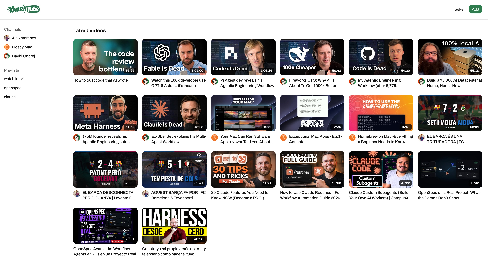

<!-- LOGO -->
<h1>

  
</h1>
  

    Minimalistic YouTube synchronizer built on top of [yt-dlp](https://github.com/yt-dlp/yt-dlp)
     
    <a href="#about">About</a>
    ·
    <a href="doc/INSTALLATION.md">Installation</a>
    ·
    <a href="doc/DEVELOPMENT.md">Developing</a>
    ·
    <a href="doc/ARCHITECTURE.md">Architecture</a>
  

  

# About

Yarrtube watches tracked Youtube playlists and channels and automatically downloads the new videos published.

Yarrtube is mainly thought to be installed on your NAS via Docker with the rest of your media stack (Plex, Jellyfin, etc.) but it can also be installed on any laptop.

# Main Features

- Track Youtube public playlists.
- Track entire channels and download new videos when they are published!
- Minimalistic webapp to see the videos from the browser in both desktop and mobile.
- Basic support for Plex, Kodi and Jellyfin.
- **Coming soon** custom playlists that let you create playlists not coupled to Youtube ones.
- **Coming soon** browser extensions to add videos to custom playlists directly from Youtube
- **Coming soon** extended support for Plex Collections.
