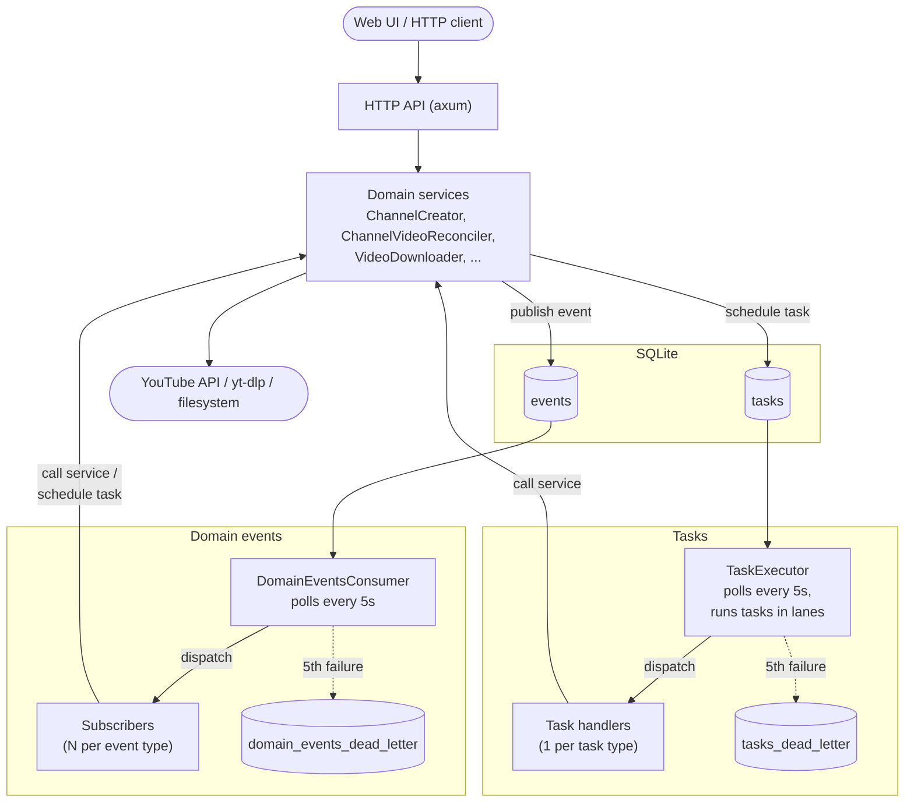
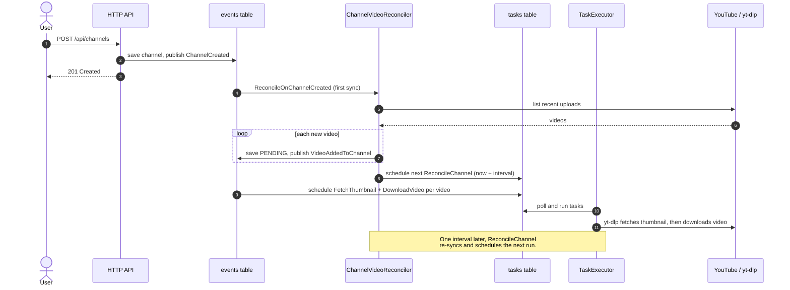

# Architecture

Yarrtube is a single process (`yarrtube serve`) backed by one SQLite database.
Inside it, the HTTP API does only the synchronous part of each request: it
validates the input, saves state and publishes a **domain event**. Everything
slow or fallible (talking to YouTube, running `yt-dlp`, touching the
filesystem) happens later in the background in an event-driven fashion.

## Architecture Overview

For more information on the architectural decisions and conventions used in Yarrtube you can take a look at the [Rust Architect skill](../.claude/skills/rust-architect/SKILL.md).

## Example: track a channel and download its videos

To illustrate this domain-driven flow we can take a look at what happens when a user adds a channel subscription and all the videos end up downloaded:

1. `POST /api/channels` saves the channel and publishes `ChannelCreated` domain event.
2. The `ReconcileOnChannelCreated` subscriber runs asynchronously, polling the domain events table (which acts like a queue), and runs the first channel sync.
   - The sync reads the channel's most recent uploads from YouTube using the YouTube API.
   - It saves each new video as `PENDING` and publishes one
     `VideoAddedToChannel` domain event per video.
   - It schedules the next `ReconcileChannel` task one reconcile interval
     later (`YARRTUBE_RECONCILE_INTERVAL_SECONDS`, default 1 hour).
3. For each `VideoAddedToChannel`, two asynchronous subscribers schedule a task each:
   - `FetchThumbnailOnVideoAddedToChannel` schedules a `FetchThumbnail`
     task.
   - `DownloadVideoOnVideoAddedToChannel` schedules a `DownloadVideo` task.
4. The `TaskExecutor` runs them. Both call `yt-dlp`. The thumbnail usually
   arrives first, so the UI can show it while the video is still downloading.
5. Every hour, the `ReconcileChannel` task runs the sync again and schedules
   the next one. New uploads repeat steps 3–4. The sync also schedules a
   `FetchThumbnail` for any video still missing its thumbnail.

## Testing

Several layers, from fast/isolated to slow/real:

- **Rust unit tests** — inline `mod tests` in domain value objects and
  entities (`src/domain/**`). Pure logic: parsing/validation, state
  transitions, invariants. No I/O.
- **Rust behavior tests** — inline `mod tests` in HTTP handlers,
  subscribers, tasks and services. Exercise the real wiring (service +
  real SQLite repos via `Connection::open_in_memory()`) with `Fake*`
  doubles only at the external boundaries (YouTube API, yt-dlp,
  filesystem). Assert the full outcome: response, persisted state, and
  events/tasks produced.
- **Rust repository tests** — inline `mod tests` in the SQLite repos,
  run against in-memory SQLite with migrations applied. Verify queries,
  mapping and persistence.
- **Web tests** (`web/`, Vitest + jsdom + Testing Library) — unit tests
  for pure logic in `src/lib/` and hooks, and component tests that render
  through the real `QueryClient`/router with only `fetch` mocked. Assert
  user-visible behavior.
- **Smoke tests** (`smoke-tests/`, Playwright) — end-to-end against the
  real Docker image, hitting the real YouTube API and downloading a real
  video with `yt-dlp`. No doubles. Covers the full create → download →
  playback flow; run manually (locally or via the `workflow_dispatch`
  workflow), not on every PR.
