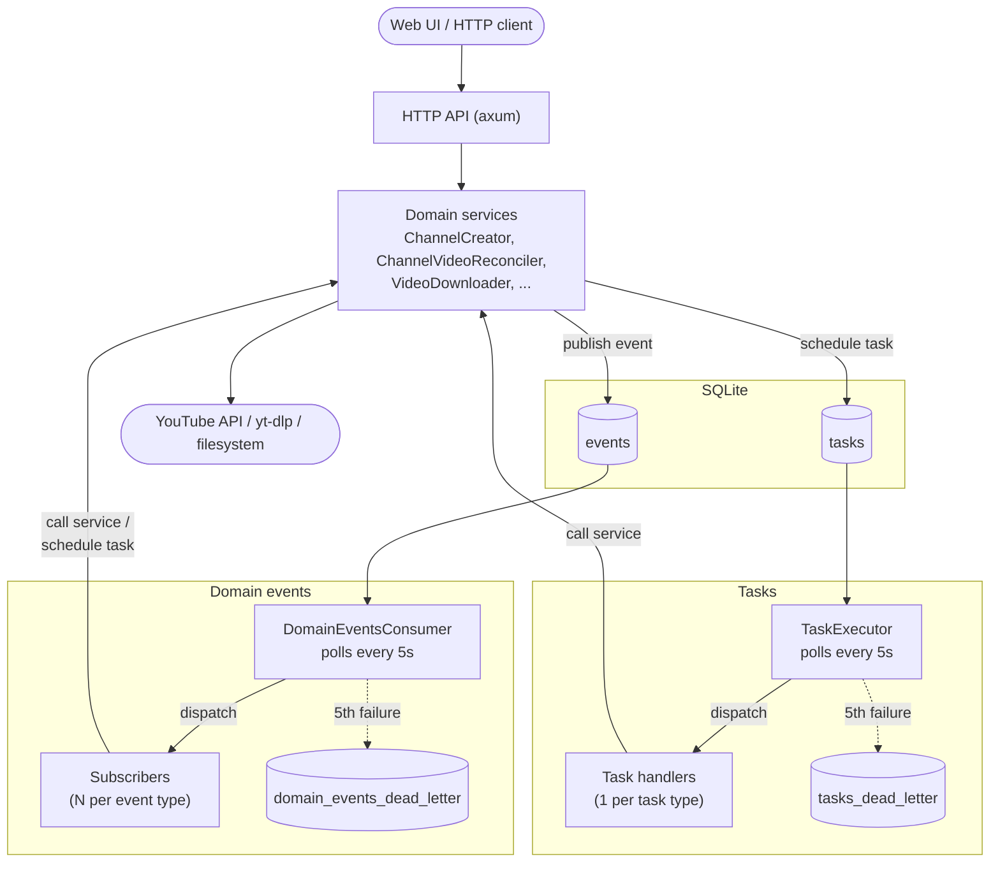
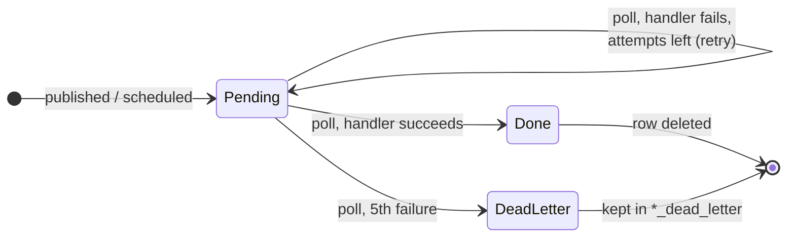
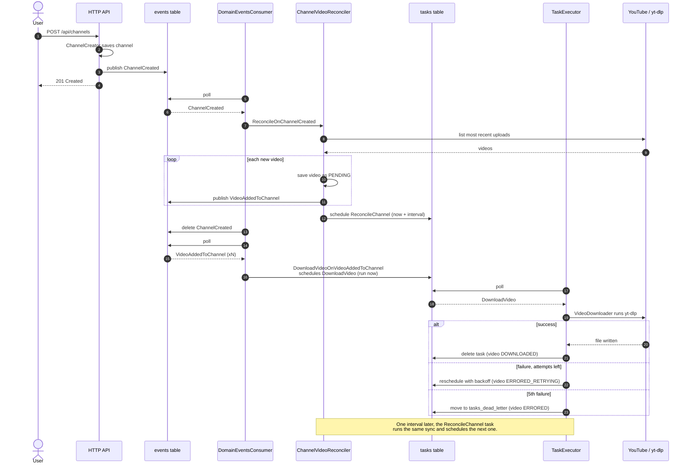

# Architecture

Yarrtube is a single process (`yarrtube serve`) backed by one SQLite database.
Inside it, the HTTP API does only the synchronous part of each request: it
validates the input, saves state and publishes a **domain event**. Everything
slow or fallible (talking to YouTube, running `yt-dlp`, touching the
filesystem) happens later in the background, driven by two SQLite-backed
queues:

- **Domain events** (`events` table): facts about something that already
  happened, such as `channel_created` or `video_added_to_channel`. Each event
  type can have any number of **subscribers**.
- **Tasks** (`tasks` table): units of work to run at a given time, such as
  `reconcile_channel` or `download_video`. Each task type has exactly one
  **handler**.

Two background loops poll these tables every 5 seconds: `DomainEventsConsumer`
for events and `TaskExecutor` for tasks. When something keeps failing, it
ends up in a **dead letter** table (`domain_events_dead_letter` /
`tasks_dead_letter`) for inspection instead of being retried forever.

## Overview

Subscribers and handlers are thin adapters: they decode a JSON payload and call
a domain service. Domain services can publish new events and schedule new
tasks, so one user action fans out into a chain of background work.

## Retries and dead letters

Both queues give an item 5 attempts. The difference is when the next attempt
runs:

| | Domain events | Tasks |
|---|---|---|
| Dispatch | Every subscriber registered for the type | The single handler for the type |
| On failure | Retried on the next poll (no delay) | Retried after `base * 3^retries` seconds (base `YARRTUBE_RETRY_BASE_DELAY_SECONDS`, default 150) |
| After 5 failed attempts | Moved to `domain_events_dead_letter` | Moved to `tasks_dead_letter` |
| On success | Row deleted | Row deleted |

An event is handled as a whole. If one of its subscribers fails, the whole
event is retried, so subscribers must be idempotent.

A task that was left `running` by a crash is recovered at startup and counted
as a failed attempt.

## Example flow: track a channel and download its videos

1. `POST /api/channels` saves the channel and publishes `ChannelCreated`.
2. The `ReconcileOnChannelCreated` subscriber runs the first sync.
   - The sync reads the channel's most recent uploads from YouTube.
   - It saves each new video as `PENDING` and publishes one
     `VideoAddedToChannel` per video.
   - It schedules the next `ReconcileChannel` task one reconcile interval
     later (`YARRTUBE_RECONCILE_INTERVAL_SECONDS`, default 1 hour).
3. For each `VideoAddedToChannel`, the
   `DownloadVideoOnVideoAddedToChannel` subscriber schedules a `DownloadVideo`
   task.
4. The `TaskExecutor` runs each `DownloadVideo` task, which calls `yt-dlp`.
5. Every hour, the `ReconcileChannel` task runs the sync again and schedules
   the next one. New uploads repeat steps 3–4.

Playlists follow the same shape with their own events (`PlaylistCreated`,
`VideoAddedToPlaylist`, ...) and tasks (`ReconcilePlaylist`). Deletions work
the same way: `ChannelDeleted` and `VideoRemovedFromChannel` schedule the
tasks that delete files.
