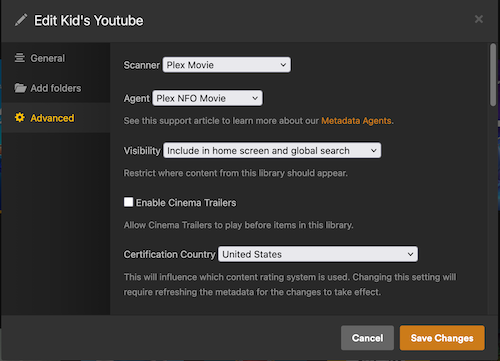
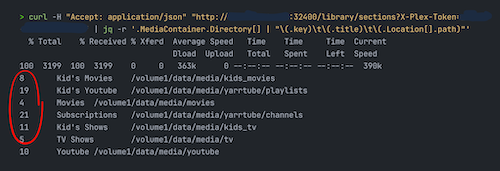

# Plex Collections integration

## What you get

While writing this (Plex Version 1.43.4.10903), collection support via NFO files is still very limited. You can, though, create collections via Plex API and this is the mechanism yarrtube uses, but it comes with some required setup.

Without the integration, a Plex library over yarrtube's videos is a flat
grid of every downloaded video. With it, yarrtube keeps **one Plex
collection per tracked playlist and channel**: the library becomes one tile
per playlist/channel, videos inside keep their playlist order (publish
order for channels), and autoplay carries you from one video to the next.

Everything below is a one-time setup. Once configured, yarrtube converges
the collections automatically in the background: new downloads are added once Plex has scanned them, videos that leave yarrtube's state are removed, and deleting a playlist/channel in yarrtube deletes its collection in Plex.

## Requirements

In order to let yarrtube create and manage collections in Plex, you need:

- Plex set up to read yarrtube's metadata files (NFOs) so it can match videos by YouTube ID.
- A Plex token (`X-Plex-Token`) to authenticate yarrtube's API requests.
- The section ID(s) of the Plex library or libraries holding your yarrtube content (like library IDs for Plex).
- The yarrtube env variables set.

## 1. Setup Plex library

Next to every video, yarrtube writes a `movie.nfo` with meta information Plex can read.
To tell Plex to read them, you need a **Movies** library with the Plex NFO Agent. You can also disable cinema trailers, credits detection and other stuff, and make sure **Use local assets** is enabled.

<p align="center">
  
</p>

## 2. Get your Plex token (`YARRTUBE_PLEX_TOKEN`)

Follow Plex's official guide:
[Finding an authentication token / X-Plex-Token](https://support.plex.tv/articles/204059436-finding-an-authentication-token-x-plex-token/).

Short version: in the Plex web app, open any library item → `⋯` →
_Get Info_ → _View XML_, and copy the `X-Plex-Token=...` value from the
opened page's URL.

## 3. Find the library section ID(s)

Section IDs are like identifiers for each Plex library. You have two ways to get the IDs of the libraries you want yarrtube to create collections in:

- **Browser URL**: open the library in the Plex web app and look at the
  address bar. The number after `source=` is the section ID.
- **API**: list all libraries and pick the `key` of the one(s) holding
  yarrtube content:

  The section ID is each library's `key`. To print just a `title → key`
  table instead of the raw JSON response, pipe it through `jq`:

  ```bash
  curl -sH "Accept: application/json" \
    "http://<YOUR_PLEX_IP>:32400/library/sections?X-Plex-Token=<YOUR_TOKEN>" \
    | jq -r '.MediaContainer.Directory[]
             | "\(.key)\t\(.title)\t\(.Location[].path)"'
  ```

  <p align="center">
    
  </p>

## 4. Configure yarrtube

Set the environment variables on the yarrtube container and restart it:

```yaml
environment:
  - YARRTUBE_PLEX_URL=http://<YOUR_PLEX_IP>:32400
  - YARRTUBE_PLEX_TOKEN=<YOUR_TOKEN>
  # the playlist library section id(s), and the channel library section
  # id(s); each takes one id or a comma-separated list (e.g. 2,5). Set
  # whichever kinds you use — you can set just one of the two:
  - YARRTUBE_PLEX_PLAYLIST_SECTION_ID=<YOUR_PLAYLIST_SECTION_ID>
  - YARRTUBE_PLEX_CHANNEL_SECTION_ID=<YOUR_CHANNEL_SECTION_ID>
  # optional, defaults to 900 (15 minutes):
  # - YARRTUBE_PLEX_RECONCILE_INTERVAL_SECONDS=900
  # recommended: the path at which Plex sees yarrtube's videos root, i.e.
  # the host side of the /videos volume (e.g. /volume1/data/media/yarrtube):
  - YARRTUBE_PLEX_VIDEOS_PATH=<HOST_PATH_MOUNTED_AT_/videos>
```

`YARRTUBE_PLEX_VIDEOS_PATH` is optional. With it, yarrtube asks Plex to
scan each video's folder as soon as the download finishes, in the
configured sections whose library folders contain it. Without it, new
videos reach Plex only through Plex's own scanning.

The integration is **off unless `YARRTUBE_PLEX_URL`, `YARRTUBE_PLEX_TOKEN`
and at least one of the two section variables are set** — without them
yarrtube behaves exactly as before and never contacts Plex.

## How the sync behaves (what to expect)

- A new video shows up in its collection only after **both** yarrtube has
  downloaded it **and** Plex has scanned it. With `YARRTUBE_PLEX_VIDEOS_PATH`
  set, yarrtube triggers that scan itself; otherwise enable Plex's "Scan my
  library automatically" so new files are picked up quickly. If it's
  missing, wait for the next sync pass; nothing needs fixing manually.
- yarrtube writes each video's `movie.nfo` before the video file, so Plex
  identifies it on import. A video Plex imported without its YouTube ID
  (e.g. before its `movie.nfo` existed) is re-matched to its `movie.nfo` by
  the next sync pass and joins its collection on the pass after.
- A collection is only created once at least one of its videos is scanned —
  you'll never see empty collections.
- Deleting a playlist/channel in yarrtube deletes its Plex collection.
  Deleting a collection by hand in Plex is not permanent: the next sync
  pass recreates it (with its current videos).
- Collections are matched **by name**: the collection's title is the
  playlist/channel name as shown in yarrtube. Renaming a collection in Plex
  will make yarrtube create a fresh one with the original name.
- If Plex is down, yarrtube keeps downloading normally; the sync pass logs
  an error and retries on the next interval.

## Troubleshooting

- **No collections appear at all**: check the startup log for
  `scheduled recurring Plex collections reconcile task` (integration
  enabled?) and for `Plex collections reconcile pass failed` errors (wrong
  URL/token/section id?). Test your values by hand:
  `curl "http://<PLEX>:32400/library/sections/<ID>/all?X-Plex-Token=<TOKEN>"`.
